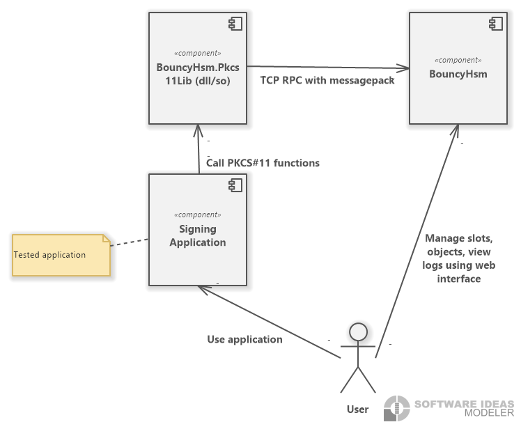

# Quick start guide for local use
To use _Bouncy Hsm_, you need to have [Net 8.0 Runtime and ASP.NET Core Runtime 8](https://dotnet.microsoft.com/en-us/download/dotnet/8.0) installed.

_Bouncy Hsm_ is standard ASP.NET Core application with native shared library implements PKCS#11 interface.
The following diagram shows usage:

1. Download `BouncyHsm.zip` from [releases](https://github.com/harrison314/BouncyHsm/releases).
1. Extract `BouncyHsm.zip` into folder.
1. If necessary, the web UI port should be changed in `appsettings.json` in `Kestrel::Endpoints::Http::Url` (and `AppBasePath`, is use base path).
1. Run `BouncyHsm.exe` on _Windows_ or `dotnet BouncyHsm.dll` on other platforms.
1. Open web UI (default run on <http://localhost:5000/>), click _Slots/Tokens_ in left menu, click _Create new_, fill form and crate first slot with token.
1. In your application configure or open native PKCS#11 library in folder `native/{your platform}/BouncyHsm.Pkcs11Lib.{dll|so}` (eg, `native/Win-x64/BouncyHsm.Pkcs11Lib.dll` for 64-bit Windows application or `native/Linux-x64/BouncyHsm.Pkcs11Lib.so` for 64-bit linux application).

For local development, there is no need to deploy _Bouncy Hsm_, just start it manually.
It is recommended to configure storage, logging and web UI port.

Native PKCS#11 does not require configuration when connecting to _localhost_.
Its configuration takes place through an environment variable, the name and value of which can be "clicked out" in the web UI in section _Configure P11 lib_.

To use _Bouncy Hsm_ on a test or staging environment, it can be deployed as a service. You can read more in [deployment guide](/Doc/Deployment.md).

