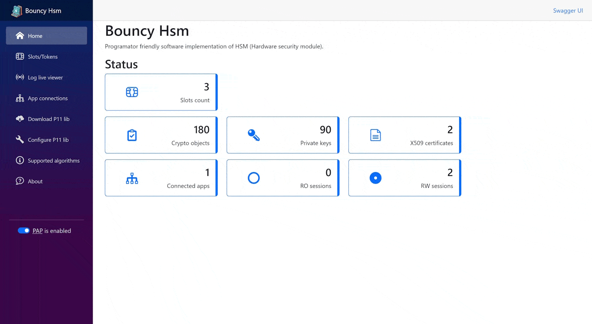

# Bouncy Hsm

_Bouncy Hsm_ is an developer friendly implementation of a cryptographic store accessible through a PKCS#11 interface.
It can simulate HSM (hardware security module) and smart cards (also with a qualified area), 
it also includes a web administration interface and a REST interface.

_Bouncy Hsm_ was created to facilitate the development and testing of applications using PKCS#11 devices.
It is not intended for production data, as it does not implement any data and key protection in storage
or during network calls.

The _BouncyHsm_ project was created as an alternative to SoftHSMv2, due to ongoing problems I had using it.

(Screenshots from version 0.4.0)

## Features
* Multiple application and users access using PKCS#11 interface.
* Slot and crypto object management using web interface and REST API.
  * Create/remove slots.
  * Import P12/PFX files.
  * Generate CSR, import certificate file.
  * Generate keys.
  * ...
* Possibility to simulate cards with a qualified area and a signature pin.
* Possibility to simulate _protected authetification path_ using web interface.
* Supports RSA keys (with size 2-6K).
* Supports [80 named elliptic curves](/Doc/SuportedAlgorithms.md#elitic-curves).
* Supports secrets (HMAC, derive,...)
* Supports AES keys.
* [Supports mechanisms](/Doc/SuportedAlgorithms.md)
* Same behavior and algorithm support across platforms and versions of Linux operating systems.
* Native PKCS#11 library without dependencies (no dependency hell, no permission configuration).
* _BouncyHsm_ runs on all platform supported [.Net 8.0](https://github.com/dotnet/core/blob/main/release-notes/8.0/supported-os.md). Moreover, it can be run as a _Windows service_ and also works on  _Raspberry Pi Zero 2 W_. Native lib _BouncyHsm.Pkcs11Lib_ is awaitable for Windows x86 and x64, Linux x64.
* CLI tool for management.

## Quick start and deployment  guide
* [Quick start guide](/Doc/QuickstartGuide.md)
* [Deployment guide](/Doc/Deployment.md)

## Contributing and issues
Pull requests are welcome. If you are not sure about the change, open an issue first.

If the found error or changes refer to the PKCS#11 standard, please complete the link section of the standard.

## Links

### Technology
* [Dotnet 8.0](https://learn.microsoft.com/en-us/dotnet/core/whats-new/dotnet-8)
* [BouncyCastle](https://github.com/bcgit/bc-csharp)
* [Pkcs11Interop](https://github.com/Pkcs11Interop)
* [LiteDb](https://www.litedb.org/)
* [Blazor WebAssembly](https://dotnet.microsoft.com/en-us/apps/aspnet/web-apps/blazor)
* [cmp](https://github.com/camgunz/cmp)
* [MessagePack-CSharp](https://github.com/neuecc/MessagePack-CSharp)

### Other links
* [PKCS #11 Cryptographic Token Interface Base Specification Version 2.40](https://docs.oasis-open.org/pkcs11/pkcs11-curr/v2.40/os/pkcs11-curr-v2.40-os.pdf)
* [Software Ideas Modeler](https://www.softwareideas.net/) - tool in which the diagrams in the documentation were drawn
* [NSwag studio](https://github.com/RicoSuter/NSwag/wiki/NSwagStudio) - tool for generate OpenApi client
